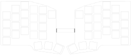

# mnhTTn48

mnhTTn48 is the a 48 key version of fookers mnhTTn column-staggered split keyboard using Cherry MX ULP switches.
Designed to be as flat and lightweight as possible.

## Features
* [Cherry MX ULP Switches](https://www.cherry.de/mx-ulp-click)
* Bluetooth [via SEEED XIAO BLE](https://www.seeedstudio.com/Seeed-XIAO-BLE-nRF52840-p-5201.html)
* Only 7.2mm height

## Layout

## PCB
[Here](/board/) you can find the KiCad fies for the PCB.

To archive minimal height, you can order the PCB as low as 0.6mm thick.
But this requires additional attention while soldering on the swithches to prevent the board from warping caused by thermal expansion.

## Keycaps
There are no keycaps available off the shelve but have been manifactured using MJF in nylon.
The models are availabe [here](/keycaps/).

## Build Guide
TODO: check if the guide fits the 5*4 layout
The build guide can be found [here](/docs/buildguide.md).

## Firmware
Copy the example [ZMK config](/zmk-config) for the mnhTTn48 to your own zmk-config repo. See [ZMK user Setup](https://zmk.dev/docs/user-setup).

## Photos
\
\
\
\

## Credits and inspirationt
Thanks to fooker for the original mnhTTn.

The idea to creat such a keyboard emerged from the wonderfull [Click! Clack! Hack!](https://www.clickclackhack.de/) community.

The layout of the board is inspired by [TOTEM](https://github.com/GEIGEIGEIST/TOTEM).

And I got a lot of help and feedback from all around the mechanical keyboard community :heart:.
